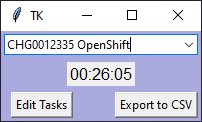

# TimeKeeper
Python program to track time.

Goal 1: track time with the least amount of distruption

Goal 2: track time with the least amount of distraction

Goal 3: track time with the least amount of effort

### Install dependencies
pip install pyyaml

#### windows
pip install pyyaml

#### linux
sudo apt-get install python-yaml

sudo apt-get install python3-tk

### How To

To run: python ./timekeeper.v2.py

To start tracking type a task name then go work on the task

To stop tracking select the blank entry in the drop down

To save to disk select a different item from the drop down, or close the program (hit X), or Edit Tasks, or hit EoD (end of day)

To restart tracking select the entry from the drop down

To change the number of minutes assigned to a task use 'Edit Tasks' button, edit, then 'Save' button

To fully delete an entry select it then hit the Delete key

Use Reset to clear all the saved time durations, such as you might do first thing Monday morning

### Timesheets

Select Export to view summarized values in Excel. Insure Excel shows values to two decimal places (otherwise it may display rounded off values).

### Caveat

Saving happens often but not on a timer. For best results remember to hit EoD at end of day.