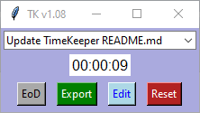

# TimeKeeper
Python program to track time.

Goal 1: track time with the least amount of distraction/distruption/effort

Goal 2: summarize task durations to xlsx for easy copying to timesheet(s)

### Install dependencies

Refer to the notes at the beginning of the file timekeeper.py

### Latest

Updated task tracking to use minutes to make 'Edit' easier

### How To

To run: python ./timekeeper.py

To start tracking: type a task name then go work on the task

To stop tracking: select the blank entry in the drop down

To restart tracking: select the entry from the drop down

To save to disk: select a different item from the drop down, or close the program (hit X), or Edit Tasks, or hit EoD (end of day)

To edit time (in minutes) assigned to a task: hit the Edit button, edit, then Save

To delete a task: select it in the dropdown and hit the Delete key

To reset all task durations to zero: hit the Reset button

To stop tacking at the end of the day: hit the EoD button

To review tasks and time spent: hit the Export button

### Timesheets

Select Export to view summarized values in Excel. Insure Excel shows values to two decimal places (otherwise it may display rounded off values).

### Caveat

Saving happens often but not on a timer. For best results remember to hit EoD at end of day.